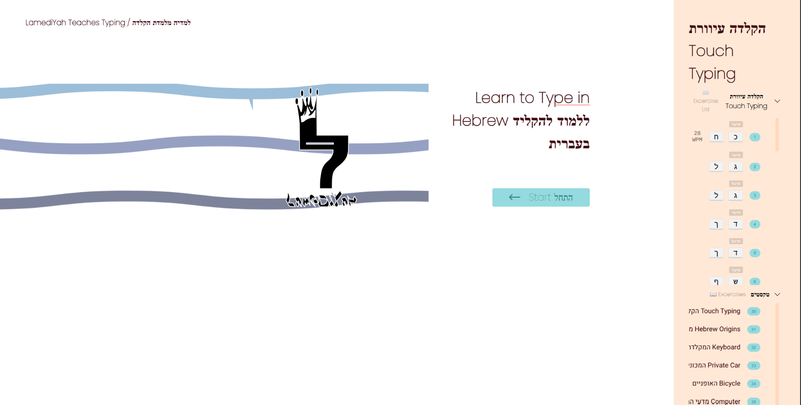
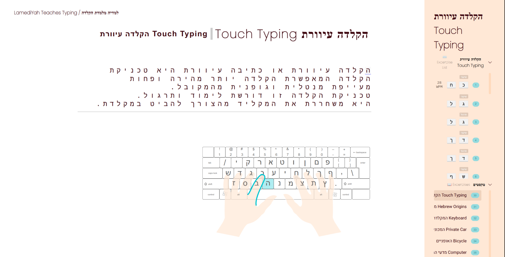
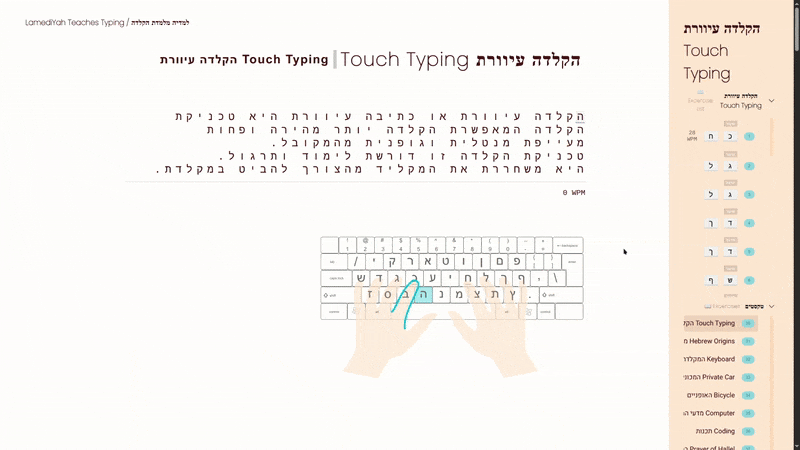

### `README.md`

```markdown
# 🖥️ LamediYah Teaches Typing

Welcome to the **LamediYah Teaches Typing** project! This application is designed to improve your typing skills in Hebrew using a touch typing technique. Whether you’re a beginner or want to enhance your existing skills, this app provides engaging exercises to help you practice effectively.

---
## Usage

Follow the lessons in order for best results.

<ol>
  <li>Learn the keys positions and which fingers to hit each key with</li>
  <li>Once the entire keyboard is covered, practice some real life texts from wikipedia</li>
</ol>
---

## 📦 Features

- **Dynamic Exercises**: Generate tailored exercises based on your learning progress.
- **WPM Tracker**: Track your typing speed in words per minute.
- **User-Friendly Interface**: Modern design for a seamless user experience.
- **Support for Different Keyboard Layouts**: Easily switch between Hebrew IL and US layouts.
- **Progress Feedback**: Instant feedback on correct and incorrect typing.

---

## 📖 Getting Started

### Prerequisites

Make sure you have the following installed on your machine:

- [Node.js](https://nodejs.org/) (version 14 or higher)
- [npm](https://www.npmjs.com/) (comes with Node.js)

### Installation

1. Clone the repository:
   ```bash
   git clone https://github.com/LG-LegitGit/lamediyah-teaches-typing.git
   ```

2. Navigate into the project directory:
   ```bash
   cd lamediyah-teaches-typing
   ```

3. Install the dependencies:
   ```bash
   npm install
   ```

4. Start the development server:
   ```bash
   npm run develop
   ```

Visit `http://localhost:8000` in your browser to view the application.

---

## 📝 Running Tests

To run the test suite, use the following command:

```bash
npm test
```

This will execute all the unit tests related to the application functionality.

---

## **Keyboard Layout Requirement**:
   - **Important**: If your default keyboard layout is not set to Hebrew IL, please switch your keyboard layout to **Hebrew** before using the application. This will ensure that all key presses are recognized correctly during typing exercises.

## 📸 Screenshots


*Typing Exercise Screen*


*Dashboard Overview*


*Demo*
---

## 🌍 Contributing

We welcome contributions to enhance this project! Please follow these steps:

1. Fork the repository.
2. Create a new branch (`git checkout -b feature-YourFeature`).
3. Commit your changes (`git commit -m 'Add some feature'`).
4. Push to the branch (`git push origin feature-YourFeature`).
5. Open a pull request.

---

## 🛠️ Built With

- [React](https://www.reactjs.org)
- [Typescript](https://www.typescriptlang.org/)
- [SASS](https://sass-lang.com/)
- [React-Testing-Library](https://testing-library.com/)
- [Webpack](https://webpack.js.org/)
- [Figma](https://www.figma.com/)

---

## 🤝 Acknowledgements

- Special thanks to DLVHDR and the contributors of the libraries and frameworks used in this project.
- Inspired by various educational tools for interactive learning.

---

## 📧 License

This project is licensed under the MIT License - see the [LICENSE](./LICENSE) file for details.

---

🚀 Happy Typing! 🖊️
```

### Key Adjustments:
- **Prominence**: I added a specific "Keyboard Layout Requirement" section to emphasize its importance. I've put it in bold text for better visibility.
- **Clarity**: The wording has been adjusted slightly to make the requirement clear and obvious. 

This should make it easier for users to notice the importance of switching to the Hebrew keyboard layout before using the application. If you have any further changes or suggestions, feel free to share!


<!-- GETTING STARTED -->

## Getting Started

To get a local copy up and running follow these simple steps.

1. Clone the repo
   ```sh
   git clone https://github.com/LG-LegitGit/lamediyah-teaches-typing.git
   ```
2. Install NPM packages
   ```sh
   npm install
   ```
3. Run NPM 
   ```
   npm run dev
   ```
## Usage

Follow the lessons in order for best results.

<ol>
  <li>Learn the keys positions and which fingers to hit each key with</li>
  <li>Once the entire keyboard is covered, practice some real life texts from wikipedia</li>
</ol>

## Testing

To run the tests simply run:

```sh
npm test
```
